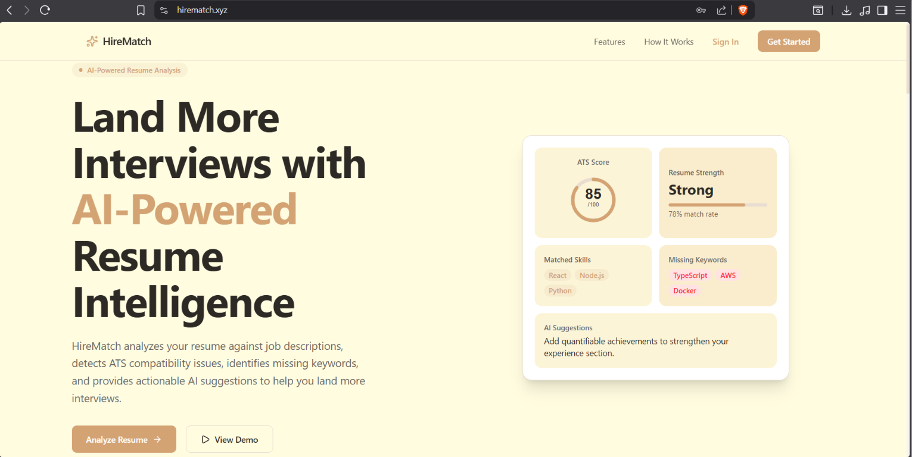
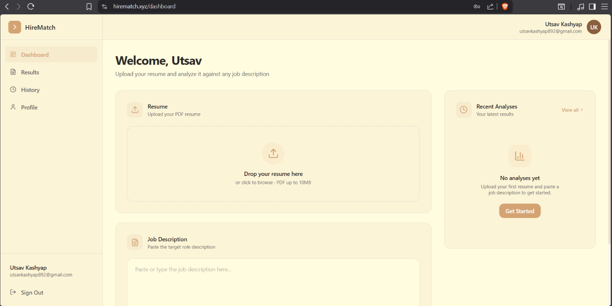
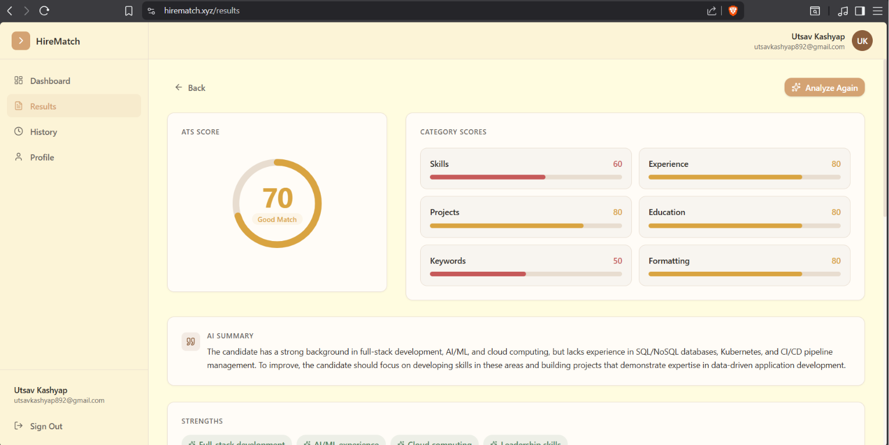
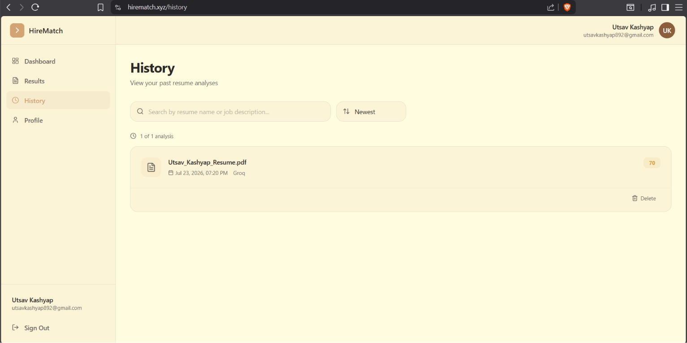

<div align="center">


<br />

# HireMatch

**AI-powered resume analysis that speaks the same language as the ATS that's screening you.**

Upload a resume. Get a real ATS score, the keywords you're missing, and rewritten bullet points — in seconds, not a recruiter's inbox later.

<br />

[](https://www.hirematch.xyz)
[](./docs)
[](./LICENSE)

<br />


</div>

<br />

---

## Engineering at a Glance

<table width="100%">
<tr>
<td width="20%" valign="top"><strong>Architecture</strong><br/>Decoupled client / API / AI layers</td>
<td width="20%" valign="top"><strong>AI Provider</strong><br/>Groq — Llama inference</td>
<td width="20%" valign="top"><strong>Cloud</strong><br/>AWS EC2, S3, Elastic IP</td>
<td width="20%" valign="top"><strong>Deployment</strong><br/>Docker Compose + Nginx</td>
<td width="20%" valign="top"><strong>Database</strong><br/>MongoDB Atlas</td>
</tr>
<tr>
<td width="20%" valign="top"><strong>Storage</strong><br/>AWS S3, metadata-linked</td>
<td width="20%" valign="top"><strong>Security</strong><br/>JWT in HTTP-only cookies, bcrypt</td>
<td width="20%" valign="top"><strong>CI/CD</strong><br/>GitHub Actions, SSH deploy</td>
<td width="20%" valign="top"><strong>Infrastructure</strong><br/>Ubuntu + Docker + Let's Encrypt</td>
<td width="20%" valign="top"><strong>Authentication</strong><br/>JWT, per-user rate limiting</td>
</tr>
</table>

---

## Preview

<table width="100%">
<tr>
<td width="50%">

<p align="center"><strong>Dashboard</strong><br/><sub>Resume history and quick-upload entry point.</sub></p>
</td>
<td width="50%">

<p align="center"><strong>Analysis View</strong><br/><sub>Structured breakdown returned by the AI pipeline.</sub></p>
</td>
</tr>
<tr>
<td width="50%">

<p align="center"><strong>ATS Score</strong><br/><sub>Quantified compatibility score with visual breakdown.</sub></p>
</td>
<td width="50%">

<p align="center"><strong>Resume History</strong><br/><sub>Every past analysis saved and retrievable per user.</sub></p>
</td>
</tr>
</table>

---

## About

Most resumes never reach a human. They're filtered, scored, and silently discarded by Applicant Tracking Systems before a recruiter ever opens them.

**HireMatch** closes that gap. Upload a resume, get back a structured, AI-generated breakdown: an ATS compatibility score, the exact keywords you're missing against a target role, a skills-gap analysis, and rewritten bullet points that read stronger without inflating your experience.

It's built as a real production system, not a weekend script — decoupled services, rate-limited APIs, containerized infrastructure, and an automated deployment pipeline, because a resume tool that goes down under load defeats its own purpose.

---

## What Makes HireMatch Different

- **Text-first AI pipeline** — resumes are parsed to clean structured text before ever reaching the LLM, which means better prompt quality, lower token cost, and consistent output shape every time.
- **Strict JSON contracts** — every AI response is constrained to a defined schema, so the frontend never has to guess what it's rendering.
- **Security by default** — JWT in HTTP-only cookies (not localStorage), bcrypt password hashing, and per-user rate limiting baked in from day one, not bolted on later.
- **Infrastructure that mirrors real production** — Docker Compose, Nginx reverse proxy, HTTPS, and a fully automated GitHub Actions deploy pipeline with health-check gating.

---

## Features

<table width="100%">
<tr>
<td width="33%" valign="top">
<h4>AI Resume Analysis</h4>
<p>Structured, model-generated breakdown of resume content against a target job description.</p>
</td>
<td width="33%" valign="top">
<h4>ATS Score Generation</h4>
<p>Quantified compatibility score modeled on real ATS parsing behavior.</p>
</td>
<td width="33%" valign="top">
<h4>Missing Skills Detection</h4>
<p>Highlights keyword and skill gaps against the target role.</p>
</td>
</tr>
<tr>
<td width="33%" valign="top">
<h4>Improvement Suggestions</h4>
<p>AI-rewritten bullet points for stronger, ATS-friendly phrasing.</p>
</td>
<td width="33%" valign="top">
<h4>Resume History</h4>
<p>Every analysis is saved and retrievable per user.</p>
</td>
<td width="33%" valign="top">
<h4>Secure Authentication</h4>
<p>JWT and HTTP-only cookies, bcrypt-hashed credentials.</p>
</td>
</tr>
<tr>
<td width="33%" valign="top">
<h4>AWS Cloud Storage</h4>
<p>Resume files persisted in S3, decoupled from application state.</p>
</td>
<td width="33%" valign="top">
<h4>Dockerized Deployment</h4>
<p>Identical environment from local dev to production.</p>
</td>
<td width="33%" valign="top">
<h4>Automated CI/CD</h4>
<p>Push to main, ship to production — automatically.</p>
</td>
</tr>
</table>

---

## Architecture

### High-Level Architecture

```
React (Vite) ──► Express API ──► MongoDB Atlas (metadata)
                     │
                     ├──► AWS S3 (resume file storage)
                     │
                     └──► Groq API / Llama (AI analysis)

              All traffic served through:
        Nginx (reverse proxy + HTTPS) ──► AWS EC2
```

### Application Layers

| Layer | Responsibility |
|---|---|
| **Frontend** (React) | Renders UI, never talks to AWS or the AI provider directly |
| **Backend** (Express) | Single source of truth — auth, validation, rate limiting, all external calls |
| **Database** (MongoDB) | User records, resume metadata, analysis history |
| **Storage** (S3) | Binary resume files, referenced by metadata in MongoDB |
| **AI** (Groq) | Resume analysis inference, constrained to strict JSON output |

### Request Flow

```
Client → Nginx → Express → [Auth Check] → [Rate Limit Check] → Handler
                                                                    │
                                            ┌───────────────────────┼───────────────────────┐
                                            ▼                       ▼                       ▼
                                        MongoDB                  AWS S3                 Groq API
```

Full breakdown in [`/docs/architecture.md`](./docs/architecture.md).

---

## Tech Stack

<details open>
<summary><strong>Frontend</strong></summary>
<br>

     

</details>

<details open>
<summary><strong>Backend</strong></summary>
<br>

    

</details>

<details open>
<summary><strong>Artificial Intelligence</strong></summary>
<br>

  — prompt engineering with strict JSON response contracts.

</details>

<details open>
<summary><strong>Cloud & Infrastructure</strong></summary>
<br>

     

</details>

<details open>
<summary><strong>DevOps</strong></summary>
<br>

 — automated CI/CD, SSH-based deployment, health-check gating, Docker image cleanup on every deploy.

</details>

---

## Engineering Decisions

Every non-obvious choice below was made deliberately — not by default.

| Decision | Reasoning |
|---|---|
| Backend is the single source of truth | The frontend never calls AWS or the AI provider directly. Every external interaction routes through Express, so API keys stay server-side and every request path gets the same auth and rate-limit checks. |
| Clean architecture — routes, controllers, services separated | Business logic doesn't live in route handlers. Swapping the AI provider or storage backend later touches one service file, not the whole codebase. |
| Resume text extracted before S3 upload | The AI never needs to touch the raw file — only the extracted text does, which cuts an unnecessary cloud round-trip out of the hot path. |
| Cleaned text sent to the AI, never raw PDFs | Removes PDF parsing noise from the prompt, which lowers token usage and produces materially more consistent output across resume formats. |
| Strict JSON prompt engineering | The AI response is constrained to a defined schema. The frontend renders against a contract, not a guess — no fragile string parsing on unpredictable model output. |
| MongoDB stores metadata only | Documents, analysis results, and user records — never binary files. Keeps the database lean and fast to query. |
| AWS S3 stores binary objects only | Object storage handles what it's built for. Database and file storage scale and back up independently of each other. |
| JWT stored in HTTP-only cookies, not localStorage | Removes the token from JS-accessible storage, closing off a major XSS attack surface. |
| Dedicated health check endpoint | A deploy is only marked successful if the backend actually responds post-deploy. Bad releases get caught by the pipeline, not discovered by users. |
| Secrets managed via GitHub Secrets | No credentials in the repository or in plain CI logs — API keys and deploy credentials are injected at runtime only. |
| Separate SSH deployment key, scoped to CI | The deploy key used by GitHub Actions is distinct from any personal key, so a compromised pipeline credential doesn't expose broader server access. |
| Docker Compose over manual deployment steps | One declarative file brings up the entire stack identically in dev and production — no manually replicated server setup steps to drift out of sync. |
| Nginx as reverse proxy | Handles HTTPS termination, routing, and static asset serving in front of the Node process, keeping those concerns out of application code. |
| Per-user rate limiting (5 analyses/day) | Protects the Groq API budget from abuse without requiring a paid tier or CAPTCHA friction for legitimate users. |

---

## Production Infrastructure

```
React  →  Express  →  MongoDB Atlas
                   →  AWS S3
                   →  Groq AI
                        │
                        ▼
                     Docker
                        │
                        ▼
                      Nginx
                        │
                        ▼
                    AWS EC2
                        │
                        ▼
                GitHub Actions (CI/CD)
```

| Component | Why it's there |
|---|---|
| **React** | Client build, served as static assets behind Nginx |
| **Express** | Sole gateway to the database, storage, and AI provider |
| **MongoDB Atlas** | Managed, backed-up storage for user data and analysis history |
| **AWS S3** | Durable, decoupled storage for uploaded resume files |
| **Groq AI** | Low-latency Llama inference for resume analysis |
| **Docker** | Identical runtime across local dev and production |
| **Nginx** | HTTPS termination and reverse proxy in front of Node |
| **AWS EC2** | Production host |
| **GitHub Actions** | Deployment automation, health-check gated |

---

## CI/CD Pipeline

Deployment is fully automated — no manual SSH-and-pull required for a routine release.

```
Developer
   │  git push
   ▼
GitHub Repository
   │
   ▼
GitHub Actions
   │
   ▼
Ubuntu Runner
   │
   ▼
SSH Authentication
   │
   ▼
AWS EC2
   │  git pull
   ▼
Docker Compose (build + up -d)
   │
   ▼
Health Check
   │
   ▼
Production Website Updated
```

If the health check fails post-deploy, the pipeline flags it immediately rather than leaving a broken container silently serving traffic.

---

## Project Structure

```
hirematch/
├── client/                 # React + Vite frontend
├── server/                 # Express API
│   ├── routes/
│   ├── controllers/
│   ├── middleware/         # auth, rate limiting
│   └── services/           # S3, Groq AI integration
├── docs/                   # Architecture, security, deployment docs
├── screenshots/            # README preview images
├── docker-compose.yml
├── nginx/
├── .github/workflows/      # CI/CD pipeline
└── README.md
```

---

## Documentation

<table width="100%">
<tr>
<td width="33%"><a href="./docs/architecture.md"><strong>Architecture</strong></a><br/><sub>System design and data flow</sub></td>
<td width="33%"><a href="./docs/authentication.md"><strong>Authentication</strong></a><br/><sub>JWT and cookie strategy</sub></td>
<td width="33%"><a href="./docs/aws.md"><strong>AWS</strong></a><br/><sub>EC2, S3, IAM setup</sub></td>
</tr>
<tr>
<td width="33%"><a href="./docs/docker.md"><strong>Docker</strong></a><br/><sub>Container and Compose setup</sub></td>
<td width="33%"><a href="./docs/nginx.md"><strong>Nginx</strong></a><br/><sub>Reverse proxy configuration</sub></td>
<td width="33%"><a href="./docs/deployment.md"><strong>Deployment Guide</strong></a><br/><sub>End-to-end release process</sub></td>
</tr>
<tr>
<td width="33%"><a href="./docs/security.md"><strong>Security</strong></a><br/><sub>Auth, rate limiting, secrets</sub></td>
<td width="33%"><a href="./docs/ci-cd.md"><strong>CI/CD</strong></a><br/><sub>GitHub Actions pipeline</sub></td>
<td width="33%"><a href="./docs/database.md"><strong>Database</strong></a><br/><sub>MongoDB schema reference</sub></td>
</tr>
<tr>
<td width="33%"><a href="./docs/api.md"><strong>API</strong></a><br/><sub>Endpoint reference</sub></td>
<td width="33%"><a href="./docs/folder-structure.md"><strong>Folder Structure</strong></a><br/><sub>Repository layout</sub></td>
<td width="33%"><a href="./docs/system-architecture.md"><strong>System Architecture</strong></a><br/><sub>Full infrastructure diagram</sub></td>
</tr>
</table>

---

## Quick Start

### Prerequisites

- Node.js 18+
- Docker & Docker Compose
- A MongoDB Atlas connection string
- AWS credentials with S3 access
- A Groq API key

### Installation

```bash
git clone https://github.com/TODO_USERNAME/hirematch.git
cd hirematch
cp .env.example .env
```

Fill in `.env` with the values described below.

### Running Locally

```bash
# Backend
cd server
npm install
npm run dev

# Frontend
cd client
npm install
npm run dev
```

### Running with Docker

```bash
docker compose up --build
```

The app will be available at `http://localhost:PORT` (see `.env`).

---

## Environment Variables

<details open>
<summary><strong>Server</strong></summary>
<br>

```env
PORT=
NODE_ENV=
```

</details>

<details open>
<summary><strong>Database</strong></summary>
<br>

```env
MONGODB_URI=
```

</details>

<details open>
<summary><strong>Authentication</strong></summary>
<br>

```env
JWT_SECRET=
```

</details>

<details open>
<summary><strong>AWS</strong></summary>
<br>

```env
AWS_ACCESS_KEY_ID=
AWS_SECRET_ACCESS_KEY=
AWS_REGION=
AWS_S3_BUCKET=
```

</details>

<details open>
<summary><strong>AI</strong></summary>
<br>

```env
GROQ_API_KEY=
```

</details>

---

## API Overview

| Method | Endpoint | Description |
|---|---|---|
| `POST` | `/api/auth/register` | Create a new user account |
| `POST` | `/api/auth/login` | Authenticate and receive session cookie |
| `POST` | `/api/resume/upload` | Upload a resume for analysis |
| `GET` | `/api/resume/history` | Retrieve past analyses for the current user |
| `GET` | `/api/health` | Deployment health check |

Full request/response schemas are documented in [`/docs/api.md`](./docs/api.md).

---

## Future Roadmap

- [ ] Resume vs. multiple job description comparison mode
- [ ] Export analysis as a shareable PDF report
- [ ] Support for additional resume formats (DOCX)
- [ ] Team/recruiter-facing bulk analysis view

---

## Contributing

Contributions are welcome. Please open an issue before submitting a large PR so the change can be discussed first.

```bash
git checkout -b feature/your-feature
git commit -m "Add: your feature"
git push origin feature/your-feature
```

---

## License

Distributed under the MIT License. See [`LICENSE`](./LICENSE) for details.

---

<div align="center">

## Author

**Utsav Kashyap**

[](https://github.com/utsavkashyap5)
[](https://linkedin.com/in/utsavkashyap-dev)
[](https://TODO_PORTFOLIO_URL)
[](mailto:TODO_EMAIL)

<br />

---

Built with React, Node.js, Docker, and AWS — designed, deployed, and maintained end-to-end.

</div>
